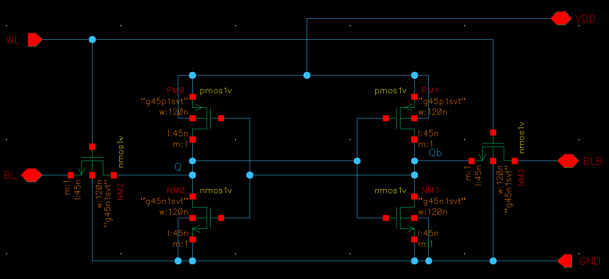
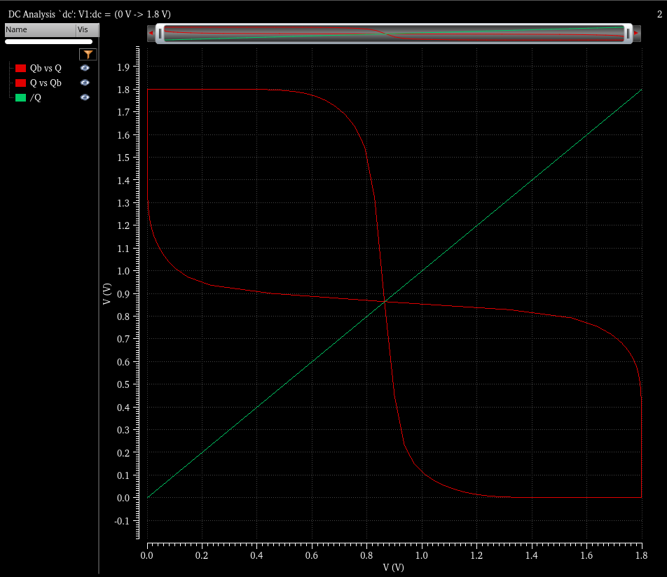
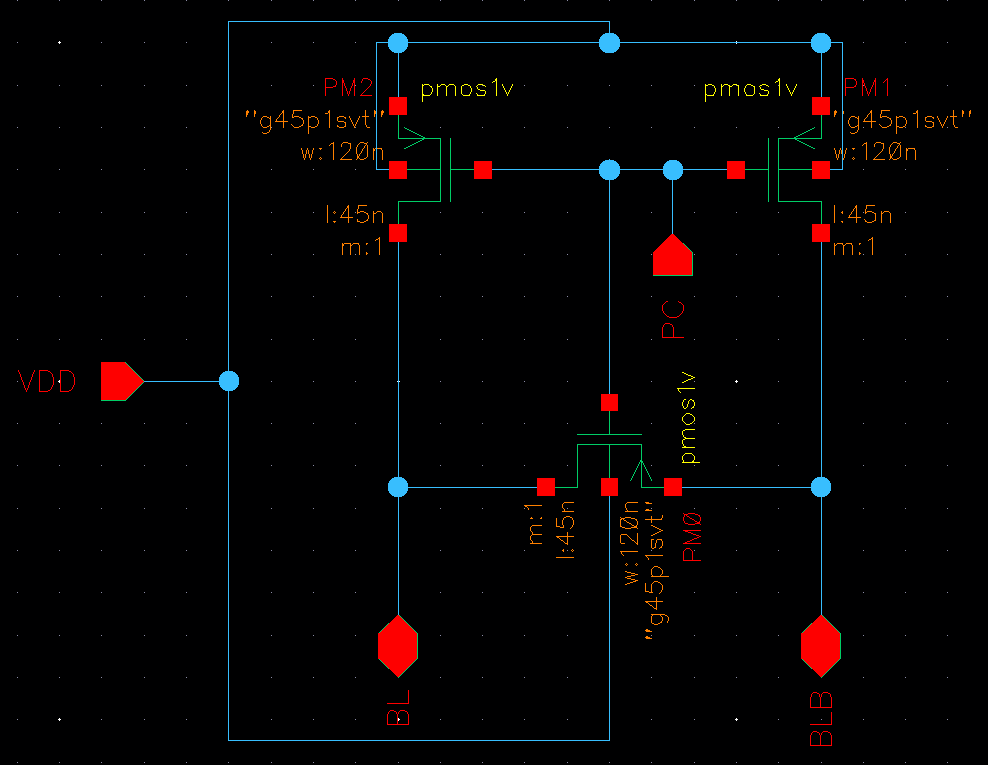
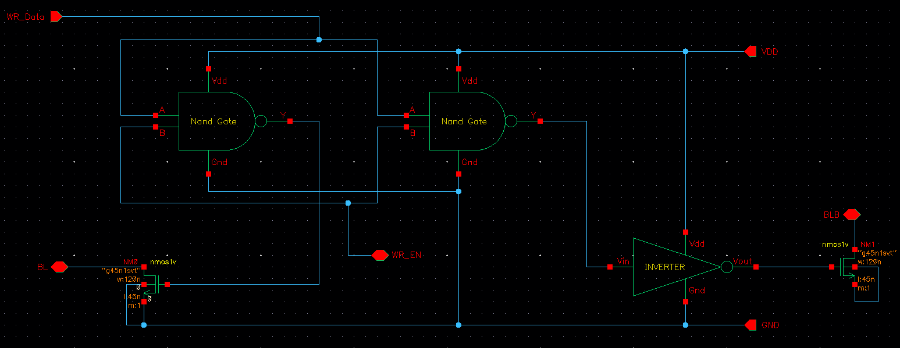
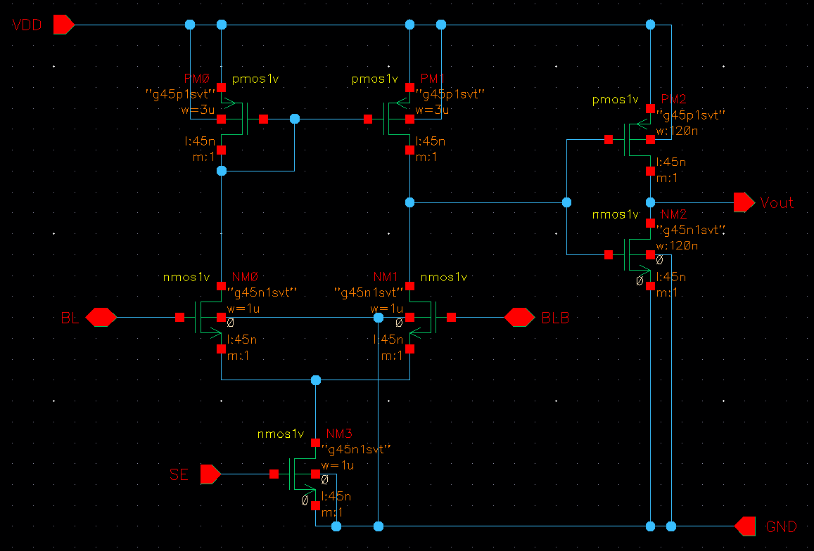
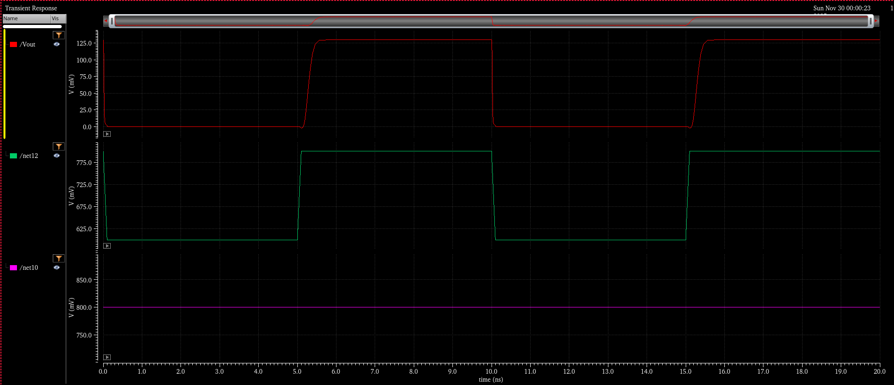
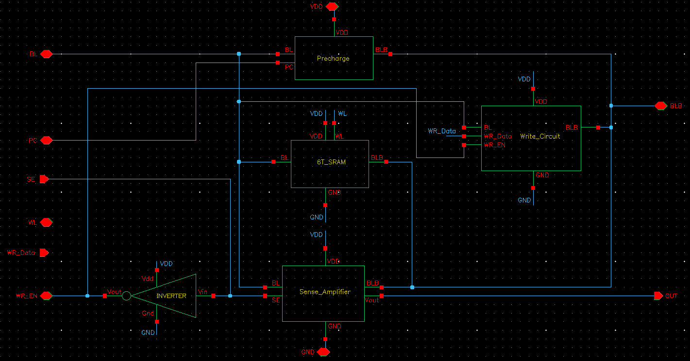
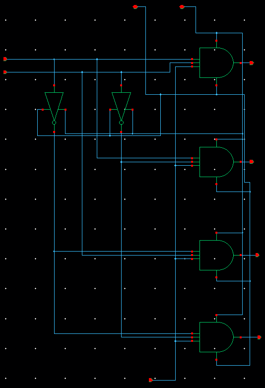
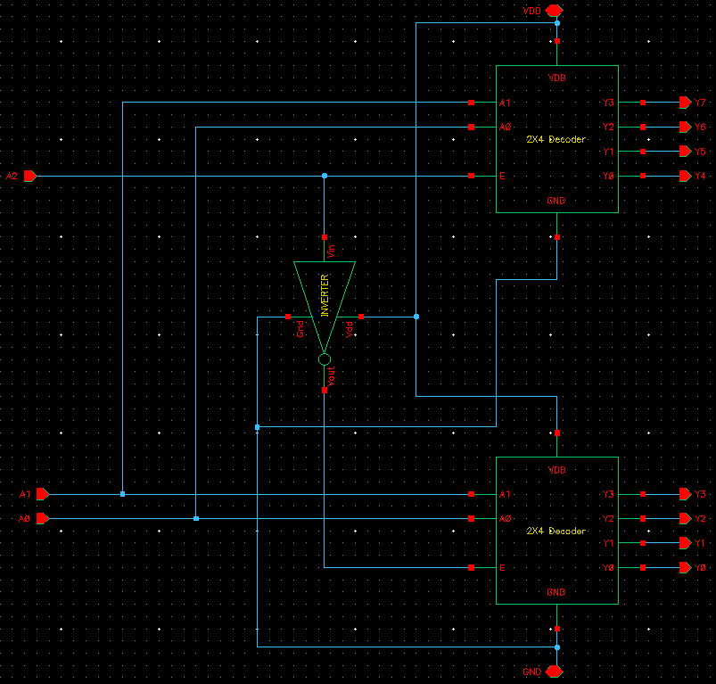
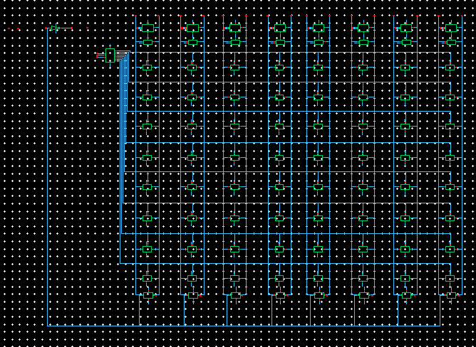

# 8×8 SRAM Memory Design using Cadence Virtuoso

## Overview
This project presents the complete design and simulation of an 8×8 SRAM memory array using 6T SRAM cells, implemented in Cadence Virtuoso as part of the Digital VLSI Design course at IIT Tirupati.

---

## 6T SRAM Cell
The fundamental storage element is a 6T SRAM cell consisting of two cross-coupled CMOS inverters and two access transistors controlled by the wordline (WL).

### Static Noise Margin (SNM)
The DC butterfly curve confirms stable bistable operation of the SRAM cell.

---

## Peripheral Circuits

### Precharge Circuit
Equalizes BL and BLB to VDD prior to read operations.

### Write Driver
Drives complementary data onto BL and BLB during write cycles.

### Sense Amplifier
Latch-type differential sense amplifier used to amplify small bitline voltage differences.

Read operation waveform:

---

## 1-Bit SRAM Integration
Integration of the 6T SRAM cell with precharge, write driver, and sense amplifier.

Transient simulation verifying correct read and write functionality:

---

## Decoder Design
A hierarchical 3×8 decoder implemented using two 2×4 decoder blocks.

---

## 8×8 SRAM Array
Complete memory array consisting of 64 identical 6T cells with column-wise shared peripheral circuits.

---

## Tools Used
- Cadence Virtuoso
- CMOS 45 nm technology (course-provided)

---

## Credits

Project by **[Benedict Jowin C](https://www.linkedin.com/in/benedict-jowin/)**  
IIT Tirupati | Electrical Engineering | Class of 2027
